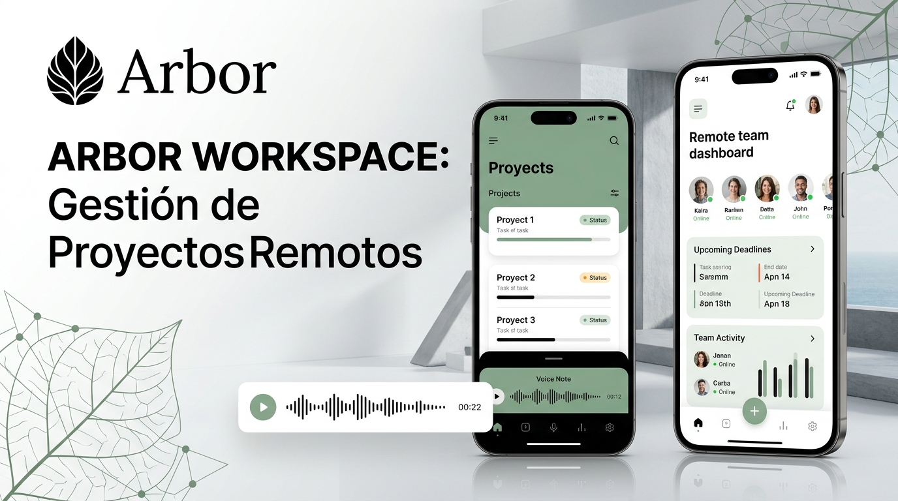

# Arbor Workspace 🌿

> **Gestión Profesional de Proyectos & Colaboración Avanzada para Equipos Remotos**  
> *Diseño minimalista de alto contraste en Blanco y Negro con espíritu orgánico y natural.*


---

## 📖 Descripción General

**Arbor Workspace** es una plataforma moderna para la gestión ágil de proyectos y la colaboración fluida entre equipos remotos distribuidos globalmente (Madrid, Bogotá, Londres, Tokio). Diseñada para integrarse de forma natural en la vida diaria de profesionales, líderes de producto e ingenieros, Arbor combina la potencia de la sincronización en tiempo real con una interfaz limpia, despejada y estética inspirada en la naturaleza.

---

## 🎨 Identidad Visual & Diseño

La interfaz de **Arbor** se rige por un principio de claridad visual absoluta:

- **Lienzo Blanco Puro (`#FFFFFF` / `#FAFCFA`)**: Máxima luminosidad, sensación de orden y eliminación de distracciones visuales.
- **Estructura y Tipografía en Negro Profundo (`#111713`)**: Jerarquía tipográfica nítida inspirada en diseño editorial contemporáneo y herramientas como Linear y Apple Design.
- **Acentos Botánicos & Naturaleza (`#234C34`, `#2C5E3B`, `#E7EFE9`)**: Verdes bosque y salvia suave que aportan calidez orgánica y equilibrio visual sin saturar la pantalla.
- **Logo Natural Adaptativo**: Icono gráfico botánico minimalista con silueta de ramas y hojas vivas, integrado en el lanzador adaptativo de Android (Adaptive Launcher Icon).

---

## ✨ Características Principales

### 1. 🗂️ Gestión Integral de Proyectos
- Tableros de proyectos categorizados (*Core Platform*, *Design System*, *DevOps & Cloud*).
- Métricas en tiempo real con barras de progreso orgánicas y conteo de miembros asignados.
- Creación rápida de proyectos con asignación de objetivos y entregables.

### 2. 🎙️ Registro Hablando / Notas de Voz (Voice-to-Task)
- Creación de tareas mediante dictado y notas de voz con un solo toque.
- Visualizador dinámico de ondas de audio (*waveform*) con medidor de duración y transcripción editable.
- Ideal para registrar ideas y requerimientos sobre la marcha mientras caminas o estás en reunión.

### 3. 💬 Discusión de Equipo & Mensajería en Tiempo Real
- Canal de conversación centralizado por proyecto con cifrado y presencia remota activa.
- Envío de notas de voz enriquecidas y mensajes de texto instantáneos.
- Simulación de respuestas y sincronización reactiva continua entre integrantes.

### 4. 📈 Actividades en Vivo (Audit Trail)
- Registro cronológico de todos los eventos del equipo: avances de tareas, grabaciones de audio, hitos y aprobaciones.
- Etiquetas visuales por categoría de evento (*Voz*, *Tarea*, *Proyecto*, *Seguridad*).

### 5. 🛡️ Matriz de Permisos & Seguridad
- Gestión de roles de equipo (*Project Director*, *Senior Mobile Engineer*, *UX Lead*, *Cloud Engineer*).
- Políticas de permisos configurables para notas de voz, sincronización multi-zona horaria y cifrado.
- Integración nativa con los permisos del sistema Android:
  - `RECORD_AUDIO`: Para captura de notas de voz y dictado rápido.
  - `POST_NOTIFICATIONS`: Para alertas instantáneas de equipo y entregas de sprint.

### 6. 📱💻 Adaptabilidad Móvil y Escritorio
- **Dispositivos Móviles**: Barra de navegación inferior ergonómica que respeta las barras del sistema (`navigationBarsPadding`).
- **Tabletas y Modo Escritorio (Foldables/Desktop)**: Transición automática a `NavigationRail` lateral con vista espaciosa y paneles maestro-detalle.

---

## 📺 Vitrina Oficial en YouTube & Capturas de la App

El repositorio cuenta con material de exhibición oficial y capturas de pantalla de la interfaz:



- **Tour Oficial en Video**: Demostración 4K de la aplicación con recorrido por los módulos principales (Tablero Kanban, notas de voz, chat remoto en vivo y gestión de permisos).
- **Identidad de Marca**: Logo botánico natural de alta resolución integrado en la pantalla principal y en los iconos adaptativos de Android (`res/drawable/ic_arbor_logo.xml`).
- **Pestaña Dedicada**: Sección interactiva "YouTube & Vitrina" dentro de la propia aplicación con reproductor integrado y enlace directo de compartición.

---

## 🚀 Mejoras de Nivel 2 (Level 2 Upgrade)

Arbor Workspace ha sido elevado a **Nivel 2** con capacidades avanzadas de productividad y robustez técnica:

1. **Tablero Kanban Nivel 2**:
   - Selector dinámico de vista (*Lista Detallada* vs *Tablero Kanban Pro*).
   - 4 columnas sincronizadas: *Pendiente*, *En Progreso*, *En Revisión* y *Completada*.
   - Botones de avance y retroceso instantáneo con un solo toque (`←` y `→`).
   - Edición integral de tareas desde modal (*Título, Descripción, Prioridad, Responsable, Etiqueta, Fecha*).

2. **Métricas de Velocidad y Reporte de Sprint**:
   - Indicador visual de porcentaje de avance en tiempo real.
   - Conteo clasificado de tareas urgentes, en curso y dictadas por voz.
   - Generador y exportador de reportes de sprint mediante el Android Share Sheet nativo.

3. **Reproductor de Audio Dinámico**:
   - Animación de avance en tiempo real de las ondas de audio (*soundwave ticker*).
   - Cronómetro de reproducción y transcripción editable.

4. **Colaboración Multi-Huso Horario en Vivo**:
   - Seguimiento continuo de la hora actual en centros de trabajo remotos (Madrid, Bogotá, Londres y Tokio).

5. **Compilación Robusta de APK**:
   - Pipeline de construcción verificado con Gradle para generar el APK sin fallos ni dependencias rotas (`gradle :app:assembleDebug`).

---

## 🏗️ Arquitectura Técnica

```
com.example
├── MainActivity.kt               # Entrypoint y configuración de Edge-to-Edge
├── data
│   ├── local
│   │   ├── ArborDao.kt           # Consultas reactivas Flow<T> con Room
│   │   └── ArborDatabase.kt      # Base de datos SQLite local persistente
│   ├── model
│   │   └── Models.kt             # Entidades: Project, Task, ChatMessage, ActivityLog, User, Notification
│   └── repository
│       └── ArborRepository.kt    # Abstracción de datos, seed inicial y lógica de negocio
├── ui
│   ├── MainAppLayout.kt          # Diseño adaptativo (Móvil vs Escritorio)
│   ├── components
│   │   └── CommonComponents.kt   # Encabezado, badges, waveforms, barra de búsqueda y grabación
│   ├── screens
│   │   ├── ProjectsScreen.kt     # Panel de proyectos y métricas de espacio
│   │   ├── TasksScreen.kt        # Tareas con filtros, kanban y registro por voz
│   │   ├── CollaborationScreen.kt# Chat en tiempo real y flujo de actividades
│   │   ├── TeamPermissionsScreen.kt# Roles, cambio de usuario y permisos Android
│   │   └── NotificationsScreen.kt# Centro de notificaciones y alertas
│   └── theme
│       ├── Color.kt              # Paleta blanco, negro y acentos botánicos
│       ├── Theme.kt              # ArborTheme con Material 3
│       └── Type.kt               # Tipografía con escala accesible
└── viewmodel
    └── ArborViewModel.kt         # Gestión de estados reactivos StateFlow
```

---

## 🚀 Compilación y Ejecución

### Prerrequisitos
- Android Studio Ladybug / Koala o superior
- JDK 17 o 21
- Android SDK 35+ / compileSdk 36

### Comandos de Gradle

```bash
# Compilar la aplicación en modo Debug
gradle assembleDebug

# Ejecutar pruebas unitarias locales con Robolectric
gradle :app:testDebugUnitTest

# Verificar pruebas de captura de pantalla (Roborazzi)
gradle :app:verifyRoborazziDebug
```

---

## 📄 Licencia

Este proyecto se distribuye bajo los términos de la Licencia Apache 2.0. Desarrollado con dedicación para equipos remotos que buscan foco, elegancia y rendimiento en su día a día.
